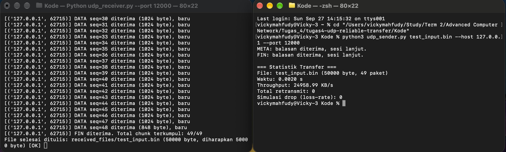
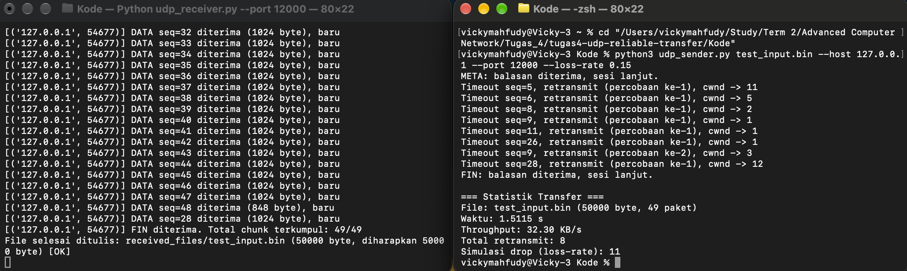
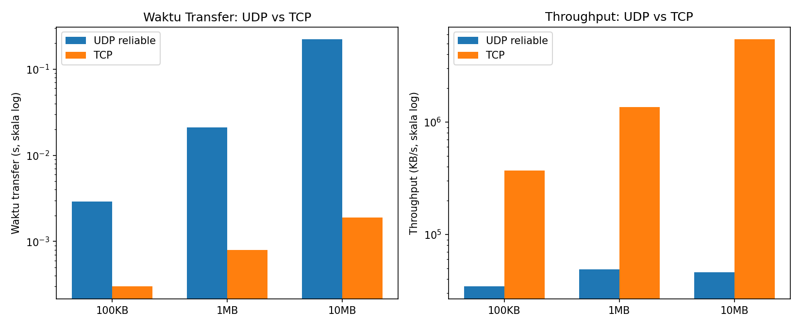

## 1. Pendahuluan

Bagian 1.2 dari Tugas 4 meminta pengembangan layanan transfer file di atas
UDP dengan keandalan (reliability) yang dibangun sendiri di level aplikasi,
karena UDP secara bawaan tidak menjamin pengiriman, urutan, maupun deteksi
korupsi data. Empat komponen wajib menurut brief adalah:

1. Penomoran urutan paket (sequence numbering)
2. Pengakuan (ACK) dan pengiriman ulang otomatis (retransmission)
3. Kontrol kemacetan sederhana (congestion control)
4. Pemisahan data & informasi kendali

Bagian ini juga meminta perbandingan kinerja dengan transfer file melalui
TCP, sehingga selain sistem UDP reliable dibangun juga baseline TCP
sederhana sebagai pembanding.

Implementasi dan pengujian dilakukan di localhost (127.0.0.1).

## 2. Desain Protokol

### 2.1 Format Paket

Setiap paket UDP dibungkus header biner 9 byte, diikuti payload:

```
seq_num (4B) | packet_type (1B) | checksum CRC32 (4B) | payload (0..1024B)
```

Field `packet_type` memisahkan **informasi kendali** dari **data aplikasi**
secara eksplisit di level protokol (bukan tercampur dalam payload):

| Tipe      | Arah              | Fungsi                                     |
|-----------|-------------------|---------------------------------------------|
| `META`    | sender -> receiver | Kirim nama file, ukuran, & total paket sekali di awal sesi |
| `DATA`    | sender -> receiver | Satu chunk isi file (maks 1024 byte payload) |
| `ACK`     | receiver -> sender | Konfirmasi satu seq_num tertentu diterima OK |
| `FIN`     | sender -> receiver | Semua data sudah dikirim, minta tutup sesi |
| `FIN_ACK` | receiver -> sender | Konfirmasi FIN diterima, sesi boleh ditutup |

Checksum CRC32 dihitung dari payload saja dan diverifikasi ulang di sisi
penerima; paket yang gagal verifikasi dibuang tanpa dibalas ACK, sehingga
sender akan meretransmisinya setelah timeout (lihat 2.3).

Potongan kode header (`Kode/protocol.py`):

```python
HEADER_FORMAT = '!IBI'  # seq_num (4B), packet_type (1B), checksum (4B)
HEADER_SIZE = struct.calcsize(HEADER_FORMAT)

def decode_packet(data: bytes) -> Packet:
    seq_num, raw_type, checksum = struct.unpack(HEADER_FORMAT, data[:HEADER_SIZE])
    payload = data[HEADER_SIZE:]
    computed = zlib.crc32(payload) & 0xFFFFFFFF
    if computed != checksum:
        raise ChecksumError(...)
    ...
```

### 2.2 Sequence Numbering & Selective Repeat

Setiap paket DATA memiliki `seq_num` unik berurutan mulai dari 0. Receiver
menyimpan setiap chunk yang lolos checksum ke dalam buffer berbasis
`seq_num` (dictionary), bukan menolak paket yang datang di luar urutan.
Ini menjadikan mekanisme yang diimplementasikan bertipe **selective
repeat**, bukan go-back-N: jika satu paket hilang, hanya paket itu yang
perlu dikirim ulang, paket lain di window tetap diterima dan disimpan.

### 2.3 ACK & Retransmisi Otomatis

Sender memberi setiap paket in-flight sebuah timer independen
(per-packet timeout, `TIMEOUT_SECONDS = 0.5` detik). Jika ACK untuk
seq_num tertentu tidak diterima sebelum timer itu habis, hanya paket
tersebut yang diretransmit (maksimum `MAX_RETRIES_PER_PACKET = 10`
percobaan sebelum transfer dibatalkan sebagai gagal permanen).

### 2.4 Kontrol Kemacetan Sederhana (AIMD)

Congestion window (`cwnd`) menentukan berapa banyak paket boleh
"in-flight" (terkirim, belum ter-ACK) secara bersamaan:

- Mulai dari `cwnd = 1` (analog slow start, disederhanakan tanpa fase
  congestion avoidance penuh)
- Setiap ACK baru diterima: `cwnd += 1`, dibatasi `MAX_CWND = 32`
- Setiap timeout terjadi (indikasi kemacetan/loss): `cwnd = max(1, cwnd // 2)`
  (multiplicative decrease)

Potongan kode (`Kode/udp_sender.py`):

```python
seq = reply.seq_num
if 0 <= seq < total_packets and not acked[seq]:
    acked[seq] = True
    self.cwnd = min(self.cwnd + 1, MAX_CWND)  # additive increase per ACK

...
if now - t_sent >= TIMEOUT_SECONDS:
    self.cwnd = max(1, self.cwnd // 2)  # multiplicative decrease per timeout
```

## 3. Pengujian Fungsional

Pengujian dilakukan dengan file test 50000 byte (49 paket) di localhost,
menjalankan `udp_receiver.py` dan `udp_sender.py` pada terminal terpisah.
Integritas file diverifikasi dengan checksum SHA-256 antara file asli dan
file hasil transfer, dan keduanya cocok persis pada seluruh skenario di
bawah.

### 3.1 Skenario Normal (Tanpa Packet Loss)

Transfer dijalankan tanpa simulasi loss. Semua 49 paket DATA diterima
berurutan, `FIN` diterima setelah 49/49 chunk terkumpul, dan file ditulis
dengan ukuran yang cocok (50000 byte, status `[OK]`). Statistik sender:
waktu 0.0020 s, throughput ~24959 KB/s, total retransmit 0.

{ width=90% }

### 3.2 Skenario dengan Simulasi Packet Loss (--loss-rate 0.15)

Sender dijalankan dengan flag `--loss-rate 0.15`, artinya setiap paket
punya probabilitas 15% "dibuang" sebelum benar-benar dikirim ke socket
(simulasi loss di sisi sender, tanpa memerlukan tool jaringan eksternal).
Hasil pengujian mencatat 11 paket disimulasikan hilang dan 8 kejadian
retransmisi (satu paket, seq=9, sempat gagal dua kali sebelum akhirnya
diterima).

Log sender menunjukkan pola `Timeout seq=X, retransmit (percobaan
ke-N), cwnd -> Y` berulang, dengan nilai cwnd yang naik ketika ACK lancar
(misalnya naik ke 11-12) dan langsung dipotong jadi kecil (bahkan ke 1)
begitu timeout terdeteksi -- perilaku AIMD yang diharapkan. Meski
mengalami loss, receiver akhirnya tetap menerima 49/49 chunk lengkap dan
file ditulis dengan status OK, membuktikan mekanisme retransmisi berhasil
mengatasi packet loss tanpa kehilangan data.

{ width=90% }

### 3.3 Deteksi Korupsi Payload

Selain simulasi loss, fungsi checksum diuji lewat unit test
(`Kode/test_protocol.py`, 10 test, seluruhnya lolos): payload yang
mengalami bit-flip terdeteksi lewat `ChecksumError` dan paket dengan
header terlalu pendek terdeteksi lewat `MalformedPacketError`. Pada level
receiver, paket yang gagal checksum dibuang tanpa ACK, sehingga secara
end-to-end perilakunya identik dengan paket hilang: sender akan
meretransmisi setelah timeout.

## 4. Baseline TCP & Perbandingan Kinerja

### 4.1 Implementasi Baseline TCP

`tcp_baseline_server.py` dan `tcp_baseline_client.py` mengimplementasikan
transfer file lewat satu koneksi TCP dengan protokol length-prefixed
sederhana (4 byte panjang nama file, nama file, 8 byte panjang isi file,
isi file). TCP menjamin reliability, ordering, dan flow/congestion control
secara native di level kernel, sehingga tidak diperlukan sequence
number, ACK, maupun logic congestion control manual seperti pada
implementasi UDP di atas.

### 4.2 Metodologi Benchmark

`benchmark.py` menjalankan `udp_sender.py` dan `tcp_baseline_client.py`
sebagai subprocess terhadap tiga ukuran file (100KB, 1MB, 10MB) secara
berurutan di localhost, tanpa simulasi loss (`--loss-rate 0.0`), untuk
mengisolasi perbandingan overhead protokol murni tanpa faktor packet
loss. Waktu transfer diukur dari saat pengiriman dimulai sampai balasan
FIN_ACK/selesai `sendall()` diterima, lalu throughput dihitung dari
ukuran file dibagi waktu tersebut.

### 4.3 Hasil

| Ukuran File | Waktu UDP (s) | Waktu TCP (s) | Throughput UDP (KB/s) | Throughput TCP (KB/s) |
|-------------|---------------|---------------|------------------------|-------------------------|
| 100 KB      | 0.0029        | 0.0003        | 34399.23               | 369173.97               |
| 1 MB        | 0.0210        | 0.0008        | 48745.85               | 1356591.46              |
| 10 MB       | 0.2213        | 0.0019        | 46268.38               | 5426844.65              |

{ width=95% }

### 4.4 Analisis Hasil

TCP secara konsisten lebih cepat daripada implementasi UDP reliable
kustom, dengan gap yang membesar seiring ukuran file (sekitar 10x lebih
cepat pada 100KB, membesar ke sekitar 116x pada 10MB). Beberapa faktor
yang menjelaskan gap ini:

- **Overhead ACK per-paket di userspace.** Implementasi UDP reliable ini
  menunggu ACK dari receiver untuk setiap paket sebelum menganggapnya
  terkirim sukses dan menggeser window, sehingga round-trip antara
  sender-receiver terjadi berulang kali (satu per beberapa paket
  tergantung cwnd), sedangkan TCP kernel memanfaatkan buffer besar,
  cumulative ACK, dan tidak memerlukan context switch userspace-kernel
  per paket aplikasi.
- **cwnd dibatasi kecil (maksimum 32 paket in-flight).** TCP di kernel
  memiliki window jauh lebih besar dan auto-tuning berdasarkan kondisi
  link, sedangkan implementasi ini membatasi window secara sederhana
  sesuai requirement brief (mendemonstrasikan mekanisme AIMD, bukan
  mengoptimalkan throughput mentah).
- **Ukuran payload per paket dibatasi 1024 byte** untuk aman dari
  fragmentasi IP, sehingga file 10MB perlu >10000 round-trip paket,
  memperbesar akumulasi overhead dibanding TCP yang bisa mengirim
  puluhan KB per segmen dengan window scaling.
- **Reliability TCP diimplementasikan di kernel (bahasa C, tanpa
  overhead interpreter)**, sedangkan reliability UDP di sini
  diimplementasikan di userspace dengan Python, yang secara inheren
  lebih lambat untuk operasi per-paket berulang dalam jumlah besar.

Gap ini adalah trade-off yang diharapkan dan konsisten dengan teori: TCP
mengoptimalkan reliability generik di kernel selama puluhan tahun,
sedangkan tujuan implementasi UDP reliable di soal ini adalah
mendemonstrasikan bahwa mekanisme reliability (sequence numbering, ACK,
retransmission, congestion control sederhana) BISA dibangun sendiri di
level aplikasi, bukan untuk mengalahkan kinerja TCP. Kelebihan potensial
UDP custom baru terasa pada skenario yang butuh kontrol penuh atas
reliability semantics (misalnya reliability per-stream seperti pada
QUIC), bukan pada throughput mentah transfer file tunggal.

## 5. Kesimpulan

Implementasi 1.2 berhasil memenuhi seluruh requirement brief: penomoran
urutan paket, ACK dan retransmisi otomatis (selective repeat, per-packet
timeout), kontrol kemacetan sederhana (AIMD: additive increase per ACK,
multiplicative decrease per timeout), serta pemisahan data dan
informasi kendali lewat field `packet_type` pada header. Pengujian
fungsional membuktikan integritas file tetap terjaga (checksum SHA-256
identik) baik pada kondisi normal maupun saat disimulasikan packet loss.
Perbandingan dengan baseline TCP menunjukkan TCP jauh lebih cepat karena
reliability native di kernel, sesuai ekspektasi teori jaringan komputer,
dan mengonfirmasi bahwa kompleksitas implementasi reliability manual di
atas UDP sepadan dengan overhead kinerja yang dihasilkan.
